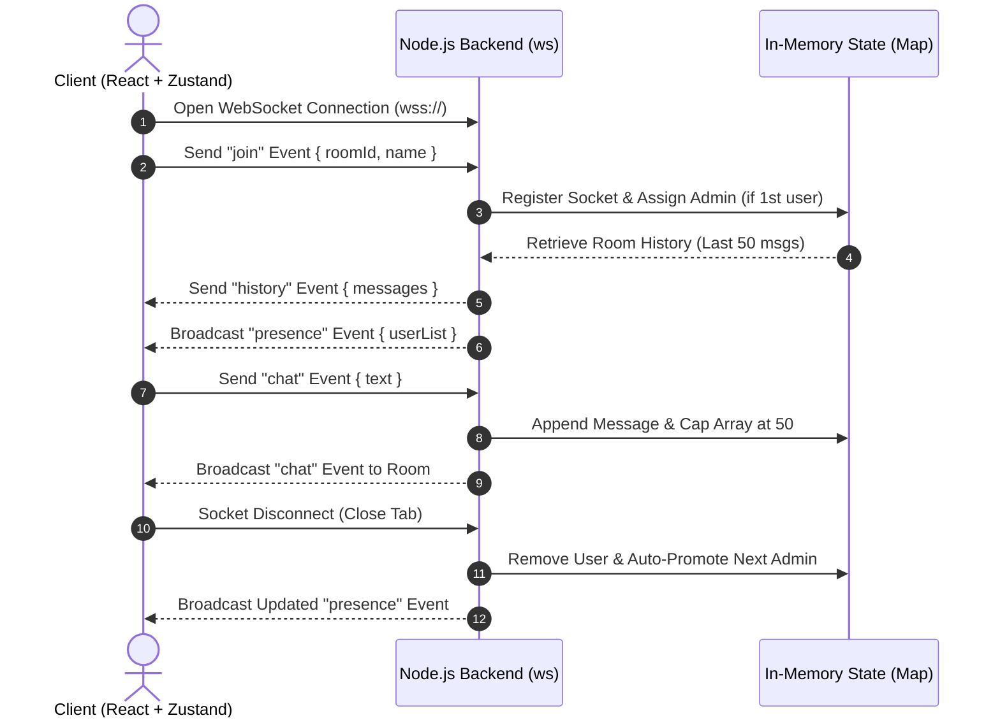

# Chatty

## 1. Problem & Solution

### Problem
- **High Friction for Temporary Communication**: Standard messaging platforms force user registration, email verification, and authentication setup just to have a quick, disposable conversation.
- **Permanent Data Exposure & Privacy Risks**: Messages are continuously saved to persistent databases, creating privacy risks and unwanted digital trails for temporary or sensitive discussions.
- **High Latency & Infrastructure Overhead**: Traditional HTTP-based polling and database read/writes add latency and unnecessary server costs for transient, real-time messages.

### Solution
- **Zero-Auth Disposable Chat Rooms**: Users enter a Room ID and handle to join instantly without sign-ups, passwords, or persistent profiles.
- **Pure In-Memory Ephemeral Storage**: Zero database dependence; room data lives strictly in server RAM and is completely wiped when users leave.
- **Sub-Millisecond WebSocket Architecture**: Full-duplex WebSocket connection paired with an in-memory 50-message rolling buffer for instant message delivery and minimal server overhead.

---

## 2. Flow of Execution



---

## 3. Important Architectural Tradeoffs

- **In-Memory Storage (`Map`) vs Database**:
  - *Gain*: 0ms database latency and maximum user privacy.
  - *Loss*: All messages wipe on server restart or when room empties.
- **Native WebSockets (`ws`) vs Socket.IO**:
  - *Gain*: Zero library overhead and low memory footprint.
  - *Loss*: Manual implementation of event framing, heartbeats, and reconnect logic.
- **50-Message Rolling Buffer vs Unlimited History**:
  - *Gain*: Strictly capped memory footprint per room.
  - *Loss*: Early messages are discarded when room message count exceeds 50.
- **Stateful WS Connections vs Serverless Architecture**:
  - *Gain*: Persistent open TCP connection for instant push updates.
  - *Loss*: Requires sticky sessions and event brokers for multi-server scaling.

---

## 4. How Would You Scale It

- **Redis Pub/Sub Layer**:
  - Distribute backend across multiple Node.js instances behind a Layer 7 Load Balancer.
  - Broadcast messages across instances using Redis Pub/Sub (`chat:room-id` channels).
- **Shared In-Memory Cache (Redis Lists)**:
  - Replace local server `Map` with Redis Lists using `LPUSH` and `LTRIM 0 49` for cross-node 50-message history retention.
- **Connection Management & Heartbeats**:
  - Enable sticky sessions (IP / Cookie routing) at the load balancer level.
  - Implement 30-second ping/pong WebSocket heartbeats to prune dead socket connections.

---

## Quick Start

### Backend
```bash
cd Real-time-Chat
npm install
npm run dev
```

### Frontend
```bash
cd "Real-Time-Chat FrontEnd"
npm install
npm run dev
```
